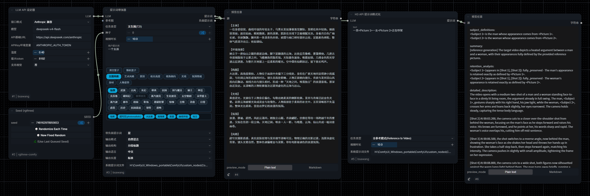

# bsawang-nodes — 提示词增强器插件（用户自建节点合集）



> ComfyUI 自定义插件（GitHub：`bsawang/comfyui-bsawang-nodes`）。**本仓库即插件**，clone 到 `ComfyUI\custom_nodes\` 即用（无需 src/ 子目录）。独立 git 仓库内嵌于 aigc-study；**运行副本在 ComfyUI 侧**：`H:\ComfyUI_Windows_portable\ComfyUI\custom_nodes\ComfyUI-bsawang\`（改代码后手动同步到运行副本）。改动日志 `AGENT-LOGGER.md` 在仓库根。
> 本插件合并原 `H3-API-格式化节点` + `提示词增强器` 两个节点包，统一 CATEGORY「提示词增强器」，右键菜单同组。

## 节点清单（3 个，全部 CATEGORY=提示词增强器）

| 节点 | 显示名 | 用途 |
|---|---|---|
| H3_API_PromptFormatter | H3 API 提示词格式化 | 反推/原始描述 → MiniMax H3 完整提示词（六段式/base 三字段） |
| LLM_API_Configurator | LLM API 设定器 | 封装 LLM 连接（接口/模型/URL/key/温度/max_tokens）→ `LLM_CONFIG` 对象 |
| Prompt_Enhancer | 提示词增强器 | LLM 连接 + 用户提示词 → 按任务类型/艺术风格增强为完整提示词 |

## 节点 1：H3 API 提示词格式化

反推文本 → H3 提示词（替代闭源 TE_H3_Prompt_Enhancer）。详见原笔记 [[knowledge/33-workflow-h3-video-reverse-prompt]]。

| 输入 | 类型 | 默认 | 说明 |
|---|---|---|---|
| LLM | LLM_CONFIG（连线） | — | 接「LLM API 设定器」输出（LLM 连接已解耦，本节点不内嵌配置） |
| text | STRING multiline | 空 | 接反推节点输出 |
| 任务类型 | combo | 全参考模式 | 全参考 / T2VA / I2VA / FL2VA / L2VA |
| 视频时长 | FLOAT | 10 | 定时间轴 |
| 系统提示词文件 | STRING | `<节点>\h3_system_prompt.txt` | H3 规范 system prompt，改 txt 即生效 |

**输出**：提示词（STRING）。陷阱：任务类型选 base 输出三字段，与 ref2va 节点不匹配——锁「全参考模式」用。

**实现要点**：无第三方 HTTP 依赖（urllib 双接口：Anthropic 兼容 `/v1/messages` + OpenAI 兼容 `/chat/completions`）；`thinking: disabled` 必开（v4-flash 推理模型不开会吃光 max_tokens）；system prompt 外置 txt（改即生效、不重启）。

## 节点 2：LLM API 设定器

| 输入 | 类型 | 默认 | 说明 |
|---|---|---|---|
| 接口格式 | combo | Anthropic 兼容 | Anthropic 兼容=/v1/messages+thinking disabled（DeepSeek 推荐）；OpenAI 兼容=/chat/completions |
| 模型 | STRING | deepseek-v4-flash | 模型名手填 |
| API基础URL | STRING | https://api.deepseek.com/anthropic | — |
| APIKey环境变量 | STRING | ANTHROPIC_AUTH_TOKEN | 从环境变量读 key，不落工作流 |
| 温度 | FLOAT | 0.4 | — |
| 最大token | INT | 8192 | — |
| 支持视觉 | combo | 否 | 该 LLM 是否支持图片输入（GLM-4V/Qwen-VL/Gemini 等选「是」；deepseek 纯文本选「否」）。增强器接图时据此判断 |

**输出**：LLM（`LLM_CONFIG` 自定义类型）。设定时即验证 key/模型/URL 存在。节点标题栏右侧显示 **token 用量圆角胶囊徽章**（仿官方 partner 节点 price_badge 样式）：`本次↑x/↓y·n次`（由下游增强器/H3 调用后更新，未调用时隐藏）。

**实现要点**：LLM 连接解耦（设定器输出 `LLM_CONFIG` 自定义类型，下游连线接收——换 LLM 只改设定器）；key 从环境变量读、不落工作流明文（`os.environ.get(APIKey环境变量)`，回退 `ANTHROPIC_AUTH_TOKEN`）。

### API Key 环境变量设置

节点通过 **环境变量** 读取 API key（`os.environ.get(APIKey环境变量)`，回退 `ANTHROPIC_AUTH_TOKEN`），**不落工作流明文**。默认走 `ANTHROPIC_AUTH_TOKEN`（DeepSeek 兼容接口）。设置方法（Windows）：

#### 方法 1：启动 bat 里设置（推荐，随 ComfyUI 启动生效）

编辑 `H:\ComfyUI_Windows_portable\run_comfyui.bat`，在启动命令前加：

```bat
set ANTHROPIC_AUTH_TOKEN=sk-你的key
```

> 本机已配置：`run_comfyui.bat` 里已含 `set ANTHROPIC_AUTH_TOKEN=sk-...`

#### 方法 2：系统环境变量（全局生效，重启 ComfyUI 生效）

`Win+R` → `sysdm.cpl` → 高级 → 环境变量 → 用户变量/系统变量 → 新建：

```
变量名: ANTHROPIC_AUTH_TOKEN
变量值: sk-你的key
```

#### 方法 3：临时设置（仅当前终端会话）

```bash
export ANTHROPIC_AUTH_TOKEN=sk-你的key
```

#### 换其他 API

LLM 设定器节点可指定 `APIKey环境变量`（如换 GLM 用 `ZHIPUAI_API_KEY`）+ `API基础URL` + `模型`，不落工作流明文。key 缺失时节点会**显式报错**（变红提示「未找到 API key」），不会静默失败。

## 节点 3：提示词增强器

> 📁 **示例工作流**：[docs/workflow_sample.json](docs/workflow_sample.json) —— 增强器完整接线（LLM 设定器 → 增强器），拖入 ComfyUI 即可用

**四栏 UI**（字段由外部字典 `dict.json` + `baskets/` 目录动态生成）：

| 栏 | 字段 |
|---|---|
| **类型选择** | 任务类型（文生图/图生图/文生视频/图生视频） |
| **类型基础信息设置** | 种子（fixed/randomize/increment/decrement）、视频时长（仅视频类型生效） |
| **内容设置** | 用户提示词、参考图（可选）+ 内容篮子（主题风格、艺术风格、景别、机位高度、视角朝向、光线、氛围情绪、身材、人物姿势、镜头运动等；按任务类型动态显隐，本地可扩展） |
| **输出设置** | 输出格式（自然语言/Tag/混合）、输出结构（连贯/分段标题）、输出语言、输出长度、带负面提示词 |

外加固定项：`LLM`（连线）、`系统提示词文件`。

**输出**：`提示词` + `负面提示词`（双 STRING 端口；带负面提示词=是 时负面端口有值，内置基础词库 + LLM 补充本次特定项）。

**核心机制**：
- **预制篮子多选**：内容层每个分类是一个「篮子」（预设 tag 池），点 chip 多选进篮子，可自由组合（主题风格选「仙侠+古风」、光线选「晨光+逆光」）。值存隐藏 state widget（JSON），ComfyUI 序列化
- **清空/随机篮子按钮**：面板顶部一键清空所有篮子 / 每篮子随机选 1 个 tag
- **tag 是建议 + 风格强约束**：篮子 tag 定基调；艺术风格/主题风格是**强约束**——选了必须体现核心视觉特征（配特点词表）
- **外部字典 + 篮子文件**：`dict.json` 定义非篮子控件；`baskets/` 目录一个篮子一个文件（自动合并）。加篮子/加值 = 加文件/改 JSON，不改代码
- **任务类型动态显隐**：前端按任务类型显示/隐藏内容分类 tab（选视频→镜头运动等出现；选图→隐藏）
- **text 是用户自由定制入口**：字典给结构约束，text 给内容自由度；未选维度 LLM 自动补全
- **参考图**：可选 IMAGE 输入，仅当 LLM 设定器「支持视觉=是」时转 base64 传 LLM 多模态；否则忽略（降级纯文本）
- **约束自检**：`mutually_exclusive`（整栏互斥：景别/机位/视角/艺术风格等）+ `conflicts`（冲突对：硬光vs柔光等）+ 跨字段矛盾（gate 字段未选但依赖字段有值）——拼接前校验，报错拦截
- **输出后处理**：分段标题压缩多余空行（连续 2+ 空行→1）
- **token 用量**：消费节点执行后从 `GET /llm_usage/last` 读本次用量，标题栏显示 `本次↑x/↓y`
- **自定义前端**：`web/prompt_enhancer_ui.js` 用 `addDOMWidget` 渲染 chip 多选 + Tab 分类 + 汇总框（`bsawang.basket` 标记），Vue 模式兼容
- 增强规则来自描述圣经：文生图→四层结构、图生图→只补缺失、文生视频→静态基础+时间轴、图生视频→只写运动增量
- **一致性规则**（txt）：身体朝向一致（禁止朝向反转）、景别-画幅一致（远景人物占比小）、主题/艺术风格强约束配特点词表

> 💬 **新增篮子**：对你的 agent 说「给 bsawang-nodes 提示词增强器增加一个『XX』类型篮子」，agent 会按[篮子制作规约](docs/BASKET_SPEC.md)制作，并同步到运行副本 `custom_nodes/ComfyUI-bsawang/baskets/`。

**实现要点**：外部字典 `dict.json` + `baskets/` 篮子文件动态合并（自动建 section、key 去重、order 排序）；篮子 widget（STRING 带 `bsawang.basket` 标记，前端 `addDOMWidget` 渲染 chip）；`guidance`/`option_guidance` 按选中篮子注入 system prompt（维度规则 + 特点词表）；条件字段（带 `condition` 仅匹配任务类型时拼进 user_msg——后端先行、UI 显隐后置）；种子 INT widget + `control_after_generate`；负面词基础库（`DEFAULT_NEGATIVE` 质量/解剖/安全三类）；敏感内容走 Anthropic 兼容接口；system prompt 外置 txt（改即生效、不重启）；错误透传（key/文件缺失/API 失败/空 content 均 `raise` → 节点变红）；token 统计（`llm_usage.py` 模块级累计 + `GET /llm_usage/last` 路由）。

## 相关

- [[knowledge/33-workflow-h3-video-reverse-prompt]] — H3 反推链（闭源坑 + 本节点方案）
- [[methods/prompts/源提示词-MiniMaxH3-AILab]] — H3 反推提示词 v8
- [[resources/prompts/标准/人物描述标准]] · [[resources/prompts/标准/图片整体描述标准]] · [[resources/prompts/标准/视频描述标准]] — 增强要点来源
- [[resources/prompts/标准/艺术风格词汇参考]] — 艺术风格下拉词源
