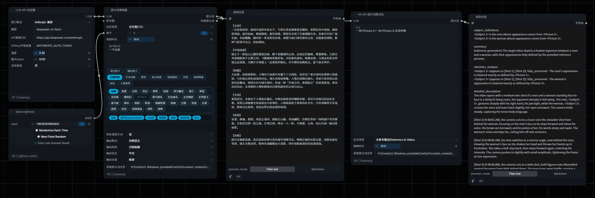

# bsawang-nodes — 提示词增强器插件（用户自建节点合集）



> ComfyUI 自定义插件（GitHub：`bsawang/comfyui-bsawang-nodes`）。**本仓库即插件**，clone 到 `ComfyUI\custom_nodes\` 即用（无需 src/ 子目录）。独立 git 仓库内嵌于 aigc-study；**运行副本在 ComfyUI 侧**：`H:\ComfyUI_Windows_portable\ComfyUI\custom_nodes\ComfyUI-bsawang\`（改代码后手动同步到运行副本）。改动日志 `AGENT-LOGGER.md` 在仓库根。
> 本插件合并原 `H3-API-格式化节点` + `提示词增强器` 两个节点包，统一 CATEGORY「提示词增强器」，右键菜单同组。
> 📐 **设计文档**：[docs/DESIGN.md](docs/DESIGN.md)（架构 / 5 节点 / Tag 管理器 / 预设系统 / 直出机制 / 踩坑）；数据/制作规约：`docs/PRESET_SPEC.md`（预设）· `docs/BASKET_SPEC.md`（篮子）

## 节点清单（5 个，全部 CATEGORY=提示词增强器）

| 节点 | 显示名 | 用途 |
|---|---|---|
| H3_API_PromptFormatter | H3 API 提示词格式化 | 反推/原始描述 → MiniMax H3 完整提示词（六段式/base 三字段） |
| LLM_API_Configurator | LLM API 设定器 | 封装 LLM 连接（接口/模型/URL/key/温度/max_tokens）→ `LLM_CONFIG` 对象 |
| Prompt_Enhancer | 提示词增强器 | LLM 连接 + 用户提示词 → 按任务类型/艺术风格增强为完整提示词 |
| Tag_Reverse | Tag 反推 | 反推文字 + LLM → 结构化 tag 集合 + 扩展建议（逐条采纳），中间节点双输出直出 |
| Tag_Library | Tag 库编辑 | 三层库管理（tag/篮子/预设）：应用/保存/删除预设、篮子加选项 |

## Tag 管理器（Tag_Reverse + Tag_Library + 预设）

补全「图片反推 → tag 集合 → 预设复用 → 增强器应用」链路，完整设计见 [docs/DESIGN.md](docs/DESIGN.md) §5-§7：

- **Tag_Reverse「Tag 反推」**：反推参考图 → 匹配的 tag 集合（可喂下游）+ 新 tag 建议（逐条采纳 / 全部采纳，采纳即写入篮子库）
- **Tag_Library「Tag 库编辑」**：篮子/预设的增删改查 + tag 管理（编辑引导语；篮子名即 key/文件名，重命名自动迁移预设引用）
- **预设系统**：把 tag 集合存为预设，增强器「预设」tab 一键应用（格式见 [docs/PRESET_SPEC.md](docs/PRESET_SPEC.md)）

## 任务模版文件夹（templates/）

各节点外置的 system prompt 统一收在 `templates/` 目录，按任务中文命名，`系统提示词文件` widget 默认指向此处，改 txt 即生效、不重启：

| 文件 | 任务 | 对应节点 |
|---|---|---|
| `templates/常规文生图.txt` | 提示词增强通用基座（文生图/图生图/文生视频/图生视频） | Prompt_Enhancer 默认 |
| `templates/H3视频提示词格式化.txt`（`.nsfw` 变体） | H3 视频提示词格式化（六段式） | H3_API_PromptFormatter 默认 |

> NSFW 后缀机制保留：`.nsfw` 变体文件按原约定命名，`.gitignore` 的 `*nsfw*` 忽略不变，本地保留、不上远程。
> 已弃用：`Krea2Edit场景融合` 为老方案（VL 反推 → LLM 融合），现已优化为 LLM 前置（Prompt_Enhancer 直接承接），不再收录。

## 节点 1：H3 API 提示词格式化

反推文本 → H3 提示词（替代闭源 TE_H3_Prompt_Enhancer）。详见原笔记 [[knowledge/33-workflow-h3-video-reverse-prompt]]。

| 输入 | 类型 | 默认 | 说明 |
|---|---|---|---|
| LLM | LLM_CONFIG（连线） | — | 接「LLM API 设定器」输出（LLM 连接已解耦，本节点不内嵌配置） |
| text | STRING multiline | 空 | 接反推节点输出 |
| 任务类型 | combo | 全参考模式 | 全参考 / T2VA / I2VA / FL2VA / L2VA |
| 视频时长 | FLOAT | 10 | 定时间轴 |
| 系统提示词文件 | STRING | `<节点>\templates\H3视频提示词格式化.txt` | H3 规范 system prompt，改 txt 即生效 |

**输出**：提示词（STRING）。陷阱：任务类型选 base 输出三字段，与 ref2va 节点不匹配——锁「全参考模式」用。

## 节点 2：LLM API 设定器

| 输入 | 类型 | 默认 | 说明 |
|---|---|---|---|
| 接口格式 | combo | Anthropic 兼容 | Anthropic 兼容=/v1/messages+thinking disabled（DeepSeek 推荐）；OpenAI 兼容=/chat/completions |
| 模型 | STRING | deepseek-v4-flash | 模型名手填 |
| API基础URL | STRING | https://api.deepseek.com/anthropic | — |
| APIKey环境变量 | STRING | ANTHROPIC_AUTH_TOKEN | 从环境变量读 key，不落工作流 |
| 温度 | FLOAT | 0.4 | — |
| 最大token | INT | 8192 | — |
| 支持视觉 | combo | 否 | 该 LLM 是否支持图片输入（GLM-4V/Qwen-VL/Gemini 等选「是」；deepseek 纯文本选「否」）。增强器接图时据此判断 |

**输出**：LLM（`LLM_CONFIG` 自定义类型）。设定时即验证 key/模型/URL 存在。token 用量在**下游消费节点**（增强器/H3/反推）执行后显示到各节点**信息栏**，此处不展示。

### API Key 环境变量设置

节点通过 **环境变量** 读取 API key（`os.environ.get(APIKey环境变量)`，回退 `ANTHROPIC_AUTH_TOKEN`），**不落工作流明文**。默认走 `ANTHROPIC_AUTH_TOKEN`（DeepSeek 兼容接口）。设置方法（Windows）：

#### 方法 1：启动 bat 里设置（推荐，随 ComfyUI 启动生效）

编辑 `H:\ComfyUI_Windows_portable\run_comfyui.bat`，在启动命令前加：

```bat
set ANTHROPIC_AUTH_TOKEN=sk-你的key
```

> 本机已配置：`run_comfyui.bat` 里已含 `set ANTHROPIC_AUTH_TOKEN=sk-...`

#### 方法 2：系统环境变量（全局生效，重启 ComfyUI 生效）

`Win+R` → `sysdm.cpl` → 高级 → 环境变量 → 用户变量/系统变量 → 新建：

```
变量名: ANTHROPIC_AUTH_TOKEN
变量值: sk-你的key
```

#### 方法 3：临时设置（仅当前终端会话）

```bash
export ANTHROPIC_AUTH_TOKEN=sk-你的key
```

#### 换其他 API

LLM 设定器节点可指定 `APIKey环境变量`（如换 GLM 用 `ZHIPUAI_API_KEY`）+ `API基础URL` + `模型`，不落工作流明文。key 缺失时节点会**显式报错**（变红提示「未找到 API key」），不会静默失败。

## 节点 3：提示词增强器

> 📁 **示例工作流**：[docs/workflow_sample.json](docs/workflow_sample.json) —— 增强器完整接线（LLM 设定器 → 增强器），拖入 ComfyUI 即可用

**四栏 UI**（字段由外部字典 `dict.json` + `baskets/` 目录动态生成）：

| 栏 | 字段 |
|---|---|
| **类型选择** | 任务类型（文生图/图生图/文生视频/图生视频） |
| **类型基础信息设置** | 种子（fixed/randomize/increment/decrement）、视频时长（仅视频类型生效） |
| **内容设置** | 用户提示词、参考图（可选）+ 内容篮子（主题风格、艺术风格、景别、机位高度、视角朝向、光线、氛围情绪、身材、人物姿势、镜头运动等；按任务类型动态显隐，本地可扩展） |
| **输出设置** | 输出格式（自然语言/Tag/混合）、输出结构（连贯/分段标题）、输出语言、输出长度、带负面提示词 |

外加固定项：`LLM`（连线）、`二次优化`（开关，默认关）、`系统提示词文件`（排节点最底部）。

**输出**：`提示词` + `负面提示词`（双 STRING 端口；带负面提示词=是 时负面端口有值，内置基础词库 + LLM 补充本次特定项）。

**功能**：
- **内容篮子多选**：主题/构图/光线/氛围/身材等分类点 chip 多选、自由组合；清空/随机按钮一键操作；按任务类型动态显隐
- **tag 优先于用户输入**：已选 tag 的内容优先于提示词原文，冲突时以 tag 为准（例：选了「光线=蝴蝶光」而提示词写「逆光」，按蝴蝶光呈现）
- **二次优化**（开关，默认关）：增强后多一次校验，输出更贴已选 tag（代价：多一次 LLM 调用）
- **约束自检**：互斥/冲突/跨字段矛盾自动拦截报错
- **预设一键应用**：预设 tab 点选即覆盖所涉篮子
- **支持参考图**（I2I/I2V 可选，需 LLM 设定器「支持视觉=是」）
- **负面提示词**：可选输出（内置基础词库 + 本次特定项）
- **token 用量**：增强器/H3/反推节点信息栏显示本次消耗

> 💬 **新增篮子**：对你的 agent 说「给 bsawang-nodes 提示词增强器增加一个『XX』类型篮子」，agent 会按[篮子制作规约](docs/BASKET_SPEC.md)制作，并同步到运行副本 `custom_nodes/ComfyUI-bsawang/baskets/`。

## 相关

- [[knowledge/33-workflow-h3-video-reverse-prompt]] — H3 反推链（闭源坑 + 本节点方案）
- [[methods/prompts/源提示词-MiniMaxH3-AILab]] — H3 反推提示词 v8
- [[resources/prompts/标准/人物描述标准]] · [[resources/prompts/标准/图片整体描述标准]] · [[resources/prompts/标准/视频描述标准]] — 增强要点来源
- [[resources/prompts/标准/艺术风格词汇参考]] — 艺术风格下拉词源
