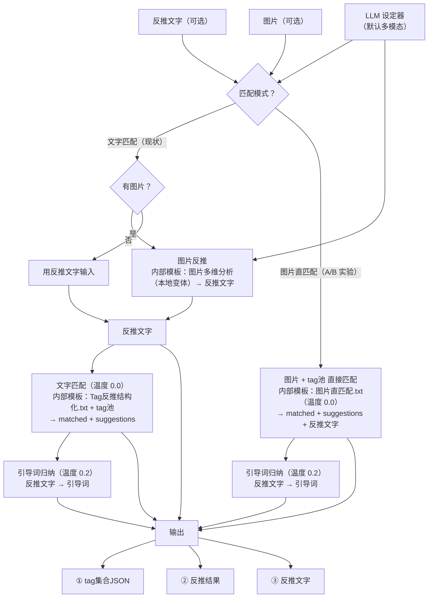

# Tag 反推节点流程（文字匹配 + 图片直匹配双模式）

> 定案版流程图。VSCode `Ctrl+Shift+V` 预览渲染；节点代码见 `tag_reverse.py`。
> 系统提示词**按功能模块内部加载**（`templates/*.txt`），不向外暴露；自定义 = 改对应 txt 文件。
> 两模式均输出 3 路：tag集合JSON / 反推结果（含引导词）/ 反推文字。

**A/B 实验设计**：两臂用同一 tag 池、同一温度（0.0 匹配 / 0.2 引导词）、同一输出格式，唯一变量是匹配阶段喂**图**（图片直匹配）还是喂**文字**（文字匹配）→ 比「图片理解 vs 文字理解」的 tag 匹配准确度。图片直匹配模式下，反推文字由模型在匹配 JSON 里顺带输出，两模式 3 路输出一致。

**内部模板模块**（`templates/`，各司其职）：

| 模板 | 功能 | git |
|---|---|---|
| `Tag反推结构化.txt` | 文字匹配 | 跟踪 |
| `图片多维分析.*.txt`（本地变体） | 图片反推 | 忽略（本地） |
| `图片直匹配.txt` | 图片直匹配 | 跟踪 |
